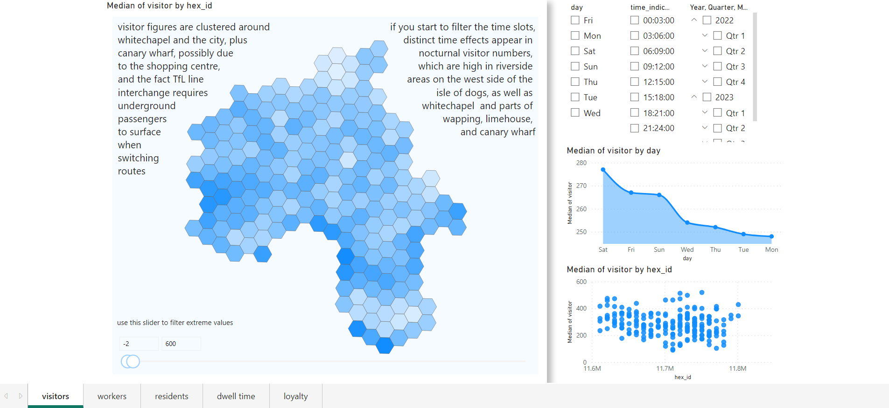

# high st data service
> preparing in python, analysing in power bi

...as seen in the [centre for data analytics](https://towerhamlets2.sharepoint.com/sites/cda/SitePages/High-streets-data-service.aspx?referrer=Yammer&referrerScenario=Feed.View)

[](https://app.powerbi.com/reportEmbed?reportId=0e1411a1-004f-4a46-aadd-a6f8297dcbb4&autoAuth=true&ctid=3c0aec87-f983-418f-b3dc-d35db83fb5d2)

```sh
├── LICENSE - GLA terms of service for data
├── tfl-350m-hex-grid-lbth.qgz - extract tfl hex grid for lbth
├── tfl-350m-hex-grid-lbth.topo.json - converted for powerbi in mapshaper.org
├── hsds.pbix - pbi report
└── hsds.ipynb - extract lbth data
```
